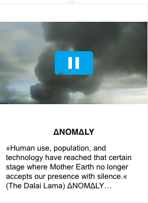

# Hyperlink previews on hover

## Setup

### Add below script in `head` tag of your html file

```html
<script src="https://cdn.linkpreview.org/js/previewer.js"></script>
```

### Add class to DOM element to get snippets on hover

```html
<a href="https://medium.com/personal-growth/the-most-important-skill-nobody-taught-you-9b162377ab77" class="preview_class">Link</a>
```

### To initialize previewer add below snippet in your html

```JS
  previewer.init({
    // optional
    defaults: {
      ...
    },
    API_KEY: 'YOU_API_KEY',
    selector: '.preview_class'
  });
```

### Make sure to initialize after page load

```JS
// vanilla javascript
window.onload = () => {
  // initialize here
}

(or)

// if you are using jquery
$( document ).ready(() => {
  // initialize here
})
```

## Supported Previews

### Articles


### Youtube / Vimeo/ Dailymotion videos are supported

   
